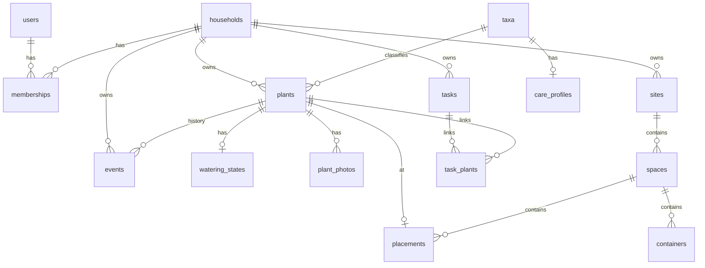

# RootCore — Database Design

**Engine:** PostgreSQL 16+  
**ORM:** SQLAlchemy 2.0 (async)  
**Migrations:** Alembic  
**Related:** [PROJECT_PLAN.md](./PROJECT_PLAN.md) · [SPEC.md](./SPEC.md) · [API.md](./API.md)

---

## 1. Design Principles

1. **Household is the tenancy boundary.** Almost every business table includes `household_id` and is queried with it.
2. **UUIDs as public primary keys** (UUIDv4 initially; UUIDv7 when driver support is easy). Never expose serial integers in URLs/QR.
3. **UTC timestamps** (`timestamptz`) everywhere.
4. **Append-friendly timeline** for history; mutable operational tables for plants/tasks.
5. **JSONB** for flexible payloads (event data, engine factor breakdown, custom attributes) with constraints where stability matters.
6. **Soft archive** for plants; hard delete rare and cascaded carefully.
7. **Idempotent engine tasks** via uniqueness on generated task keys.

### Why not multi-schema-per-tenant?

One schema, shared tables, `household_id` filters: simpler migrations, backups, and self-host single-tenant common case. Row-Level Security (RLS) is a **future hardening option**, not required for v1 if the application layer is strict and tested.

---

## 2. Entity Relationship Overview

```
users ──────────────┐
  │                 │
  │            memberships ────── households
  │                 │                 │
  refresh_tokens    │                 ├── sites ── spaces ── containers
  │                 │                 │              │
  │                 │                 │         placements ── plants ── plant_photos
  │                 │                 │              │            │
  │                 │                 │              │            ├── plant_tags ── tags
  │                 │                 │              │            ├── watering_state
  │                 │                 │              │            └── events (timeline)
  │                 │                 │              │
  │                 │                 ├── tasks ─────┘
  │                 │                 ├── weather_cache
  │                 │                 └── invitations
  │
  └── (optional) instance roles

taxa (species/cultivars) ←── plants
care_profiles ──────────←── taxa
```

---

## 3. Conventions

| Convention | Rule |
|------------|------|
| PK | `id UUID PRIMARY KEY` |
| FK | `{table_singular}_id` |
| Time | `created_at`, `updated_at` timestamptz NOT NULL |
| Soft plant exit | `archived_at`, `status` |
| Enums | PostgreSQL ENUM or text + CHECK; prefer native ENUM for stable sets |
| Money | `NUMERIC(12,2)` + `currency CHAR(3)` on household |
| Coordinates | `DOUBLE PRECISION` lat/lon; layout x/y abstract units |

---

## 4. Tables

### 4.1 `users`

| Column | Type | Notes |
|--------|------|-------|
| id | UUID PK | |
| email | CITEXT UNIQUE NOT NULL | case-insensitive |
| password_hash | TEXT NOT NULL | argon2id |
| display_name | TEXT NOT NULL | |
| timezone | TEXT NOT NULL DEFAULT `'UTC'` | IANA |
| locale | TEXT NOT NULL DEFAULT `'en'` | |
| unit_system | TEXT NOT NULL DEFAULT `'metric'` | `metric` \| `imperial` |
| theme | TEXT NOT NULL DEFAULT `'system'` | `system` \| `light` \| `dark` |
| is_active | BOOLEAN NOT NULL DEFAULT TRUE | |
| is_instance_admin | BOOLEAN NOT NULL DEFAULT FALSE | superuser on multi-tenant instances |
| email_verified_at | TIMESTAMPTZ NULL | |
| created_at | TIMESTAMPTZ | |
| updated_at | TIMESTAMPTZ | |

**Indexes:** unique(email)

---

### 4.2 `refresh_tokens`

| Column | Type | Notes |
|--------|------|-------|
| id | UUID PK | |
| user_id | UUID FK → users ON DELETE CASCADE | |
| token_hash | TEXT NOT NULL UNIQUE | store hash only |
| expires_at | TIMESTAMPTZ NOT NULL | |
| revoked_at | TIMESTAMPTZ NULL | |
| user_agent | TEXT NULL | |
| ip_address | INET NULL | |
| created_at | TIMESTAMPTZ | |

**Indexes:** (user_id), (expires_at)

---

### 4.3 `households`

| Column | Type | Notes |
|--------|------|-------|
| id | UUID PK | |
| name | TEXT NOT NULL | |
| slug | TEXT NULL | optional vanity |
| timezone | TEXT NOT NULL DEFAULT `'UTC'` | default for household |
| currency | CHAR(3) NOT NULL DEFAULT `'USD'` | collection value |
| latitude | DOUBLE PRECISION NULL | default weather point |
| longitude | DOUBLE PRECISION NULL | |
| elevation_m | DOUBLE PRECISION NULL | optional |
| registration_note | TEXT NULL | |
| settings | JSONB NOT NULL DEFAULT `{}` | feature flags, quotas |
| created_at | TIMESTAMPTZ | |
| updated_at | TIMESTAMPTZ | |

**settings examples:**

```json
{
  "member_can_delete_any_plant": false,
  "public_plant_cards": false,
  "max_plants": null,
  "max_media_bytes": 10737418240,
  "watering_run_order": "layout"
}
```

---

### 4.4 `memberships`

| Column | Type | Notes |
|--------|------|-------|
| id | UUID PK | |
| household_id | UUID FK → households ON DELETE CASCADE | |
| user_id | UUID FK → users ON DELETE CASCADE | |
| role | TEXT NOT NULL | `owner` \| `admin` \| `member` \| `viewer` |
| created_at | TIMESTAMPTZ | |
| updated_at | TIMESTAMPTZ | |

**Constraints:** UNIQUE(household_id, user_id); CHECK role in known set  

**Indexes:** (user_id), (household_id)

---

### 4.5 `invitations`

| Column | Type | Notes |
|--------|------|-------|
| id | UUID PK | |
| household_id | UUID FK | |
| email | CITEXT NULL | null if link-only invite |
| role | TEXT NOT NULL DEFAULT `'member'` | |
| token_hash | TEXT NOT NULL UNIQUE | |
| invited_by_user_id | UUID FK → users | |
| expires_at | TIMESTAMPTZ NOT NULL | |
| accepted_at | TIMESTAMPTZ NULL | |
| created_at | TIMESTAMPTZ | |

---

### 4.6 `taxa`

Taxonomic / catalog records. Global built-ins + household custom.

| Column | Type | Notes |
|--------|------|-------|
| id | UUID PK | |
| household_id | UUID NULL FK | NULL = global catalog; else household custom |
| parent_id | UUID NULL FK → taxa | cultivar → species |
| rank | TEXT NOT NULL | `species` \| `cultivar` \| `group` |
| scientific_name | TEXT NOT NULL | |
| authors | TEXT NULL | botanical authors string |
| common_names | TEXT[] NOT NULL DEFAULT `{}` | |
| family | TEXT NULL | |
| genus | TEXT NULL | denormalized for search |
| external_ids | JSONB NOT NULL DEFAULT `{}` | e.g. `{ "gbif": "..." }` |
| created_at | TIMESTAMPTZ | |
| updated_at | TIMESTAMPTZ | |

**Indexes:**  
- GIN(common_names)  
- LOWER(scientific_name)  
- (household_id)  
- UNIQUE nulls-not-distinct optional on (household_id, scientific_name, rank) — enforce in app if PG version issues  

---

### 4.7 `care_profiles`

Default care parameters for a taxon (overridable per plant).

| Column | Type | Notes |
|--------|------|-------|
| id | UUID PK | |
| taxon_id | UUID FK → taxa ON DELETE CASCADE UNIQUE | 1:1 |
| light | TEXT NULL | `low` \| `medium` \| `bright_indirect` \| `full_sun` … |
| moisture_preference | TEXT NULL | `dry` \| `medium` \| `moist` |
| drought_tolerance | TEXT NULL | `low` \| `medium` \| `high` |
| humidity_preference | TEXT NULL | |
| baseline_interval_days_min | NUMERIC(6,2) NULL | |
| baseline_interval_days_max | NUMERIC(6,2) NULL | |
| water_amount_default | TEXT NULL | `light` \| `normal` \| `deep` |
| fertilize_notes | TEXT NULL | |
| soil_notes | TEXT NULL | |
| toxic_to_pets | BOOLEAN NULL | |
| extra | JSONB NOT NULL DEFAULT `{}` | future factors |
| created_at | TIMESTAMPTZ | |
| updated_at | TIMESTAMPTZ | |

**Why separate from taxa?** Taxon identity vs care opinion; care profiles may be updated from community seeds without renaming plants.

---

### 4.8 `plants`

Living (or historical) specimens.

| Column | Type | Notes |
|--------|------|-------|
| id | UUID PK | |
| household_id | UUID FK NOT NULL | |
| taxon_id | UUID FK NULL → taxa | |
| nickname | TEXT NOT NULL | |
| status | TEXT NOT NULL DEFAULT `'active'` | active/dormant/deceased/archived |
| environment | TEXT NOT NULL DEFAULT `'indoor'` | indoor/outdoor/greenhouse |
| acquired_at | DATE NULL | |
| propagated_from_plant_id | UUID NULL FK → plants | lineage |
| pot_size_liters | NUMERIC(8,2) NULL | |
| pot_material | TEXT NULL | terracotta/plastic/ceramic/fabric/other |
| soil_type | TEXT NULL | free_draining/standard/moisture_retentive/custom |
| growth_stage | TEXT NULL | seedling/juvenile/mature |
| estimated_value | NUMERIC(12,2) NULL | |
| cover_photo_id | UUID NULL FK → plant_photos | deferrable or set null |
| custom_attributes | JSONB NOT NULL DEFAULT `{}` | |
| notes | TEXT NULL | |
| deceased_at | DATE NULL | |
| deceased_reason | TEXT NULL | |
| archived_at | TIMESTAMPTZ NULL | |
| created_by_user_id | UUID NULL FK → users | |
| created_at | TIMESTAMPTZ | |
| updated_at | TIMESTAMPTZ | |

**Indexes:**  
- (household_id, status)  
- (household_id, nickname)  
- (taxon_id)  
- GIN(custom_attributes) optional  

---

### 4.9 `tags` & `plant_tags`

| `tags` | Type | Notes |
|--------|------|-------|
| id | UUID PK | |
| household_id | UUID FK | |
| name | TEXT NOT NULL | |
| color | TEXT NULL | |

UNIQUE(household_id, lower(name))

| `plant_tags` | |
|--------------|---|
| plant_id | FK |
| tag_id | FK |
| PK (plant_id, tag_id) | |

---

### 4.10 `plant_photos`

| Column | Type | Notes |
|--------|------|-------|
| id | UUID PK | |
| household_id | UUID FK NOT NULL | denormalized for authz/storage |
| plant_id | UUID FK → plants ON DELETE CASCADE | |
| storage_key | TEXT NOT NULL | relative path |
| thumb_key | TEXT NULL | |
| display_key | TEXT NULL | |
| mime_type | TEXT NOT NULL | |
| byte_size | BIGINT NOT NULL | |
| width | INT NULL | |
| height | INT NULL | |
| caption | TEXT NULL | |
| taken_at | TIMESTAMPTZ NULL | |
| uploaded_by_user_id | UUID NULL | |
| created_at | TIMESTAMPTZ | |

**Indexes:** (plant_id, created_at DESC)

---

### 4.11 Layout: `sites`, `spaces`, `containers`, `placements`

#### `sites`

| Column | Type | Notes |
|--------|------|-------|
| id | UUID PK | |
| household_id | UUID FK | |
| name | TEXT NOT NULL | Home, Cabin |
| latitude | DOUBLE PRECISION NULL | overrides household weather |
| longitude | DOUBLE PRECISION NULL | |
| timezone | TEXT NULL | |
| sort_order | INT NOT NULL DEFAULT 0 | |
| created_at / updated_at | | |

#### `spaces`

| Column | Type | Notes |
|--------|------|-------|
| id | UUID PK | |
| household_id | UUID FK | denormalized |
| site_id | UUID FK → sites ON DELETE CASCADE | |
| name | TEXT NOT NULL | Living room |
| kind | TEXT NOT NULL DEFAULT `'room'` | room/greenhouse/balcony/garden_bed/other |
| canvas_width | INT NOT NULL DEFAULT 1000 | abstract units |
| canvas_height | INT NOT NULL DEFAULT 800 | |
| background_image_key | TEXT NULL | |
| sort_order | INT NOT NULL DEFAULT 0 | |
| created_at / updated_at | | |

#### `containers`

Optional grouping within a space (shelf, tent, bed segment).

| Column | Type | Notes |
|--------|------|-------|
| id | UUID PK | |
| household_id | UUID FK | |
| space_id | UUID FK → spaces ON DELETE CASCADE | |
| name | TEXT NOT NULL | |
| kind | TEXT NULL | shelf/bed/rack/other |
| x, y, width, height | NUMERIC | position on space canvas |
| sort_order | INT NOT NULL DEFAULT 0 | |
| created_at / updated_at | | |

#### `placements`

| Column | Type | Notes |
|--------|------|-------|
| id | UUID PK | |
| household_id | UUID FK | |
| plant_id | UUID FK → plants ON DELETE CASCADE UNIQUE | one placement per plant v1 |
| space_id | UUID FK → spaces ON DELETE CASCADE | |
| container_id | UUID NULL FK → containers ON DELETE SET NULL | |
| x | NUMERIC(10,2) NOT NULL DEFAULT 0 | |
| y | NUMERIC(10,2) NOT NULL DEFAULT 0 | |
| width | NUMERIC(10,2) NULL | avatar size on canvas |
| height | NUMERIC(10,2) NULL | |
| rotation_deg | NUMERIC(6,2) NOT NULL DEFAULT 0 | |
| updated_at | TIMESTAMPTZ | |

**Why one placement per plant?** A physical plant is in one place. Moving emits a `relocated` event and updates placement.

**Indexes:** (space_id), (household_id)

---

### 4.12 `events` (timeline)

| Column | Type | Notes |
|--------|------|-------|
| id | UUID PK | |
| household_id | UUID FK NOT NULL | |
| plant_id | UUID NULL FK → plants ON DELETE SET NULL | null = household-level |
| actor_user_id | UUID NULL FK → users | null = system |
| type | TEXT NOT NULL | see enum below |
| occurred_at | TIMESTAMPTZ NOT NULL | when care happened |
| payload | JSONB NOT NULL DEFAULT `{}` | type-specific |
| task_id | UUID NULL FK → tasks | if created from task |
| created_at | TIMESTAMPTZ | insert time |
| deleted_at | TIMESTAMPTZ NULL | soft hide |

**Types:**  
`watered`, `fertilized`, `pruned`, `repotted`, `propagated`, `harvested`, `cleaned`, `relocated`, `note`, `photo_added`, `health_check`, `identified`, `status_changed`, `custom`

**Example payloads:**

```json
// watered
{
  "amount": "normal",
  "volume_ml": 250,
  "method": "top",
  "moisture_before": "dry",
  "notes": "soaked fully"
}

// relocated
{
  "from_space_id": "...",
  "to_space_id": "...",
  "from_container_id": null,
  "to_container_id": "..."
}

// identified
{
  "provider": "plantnet",
  "candidates": [{"score": 0.87, "scientific_name": "..."}],
  "applied_taxon_id": "..."
}
```

**Indexes:**  
- (household_id, occurred_at DESC)  
- (plant_id, occurred_at DESC)  
- (household_id, type, occurred_at DESC)  

---

### 4.13 `watering_states`

Cached engine output + learning parameters per plant. Separated from `plants` to keep specimen table lean and engine updates hot.

| Column | Type | Notes |
|--------|------|-------|
| plant_id | UUID PK FK → plants ON DELETE CASCADE | |
| household_id | UUID FK NOT NULL | |
| next_due_at | TIMESTAMPTZ NULL | |
| urgency | TEXT NOT NULL DEFAULT `'ok'` | ok \| soon \| due \| overdue |
| recommended_amount | TEXT NULL | light/normal/deep |
| confidence | NUMERIC(4,3) NULL | 0–1 |
| moisture_score | NUMERIC(6,5) NULL | 0–1 proxy |
| factor_breakdown | JSONB NOT NULL DEFAULT `[]` | explainability |
| interval_bias_days | NUMERIC(8,3) NOT NULL DEFAULT 0 | learning |
| threshold_bias | NUMERIC(8,5) NOT NULL DEFAULT 0 | learning |
| last_watered_at | TIMESTAMPTZ NULL | denorm from events |
| last_computed_at | TIMESTAMPTZ NULL | |
| paused_until | TIMESTAMPTZ NULL | user pause |
| manual_next_due_at | TIMESTAMPTZ NULL | override |
| feedback_counts | JSONB NOT NULL DEFAULT `{"too_dry":0,"ok":0,"too_wet":0}` | |
| updated_at | TIMESTAMPTZ | |

**Indexes:** (household_id, next_due_at), (household_id, urgency)

---

### 4.14 `watering_feedback`

Optional detailed log for learning analytics (in addition to counters).

| Column | Type | Notes |
|--------|------|-------|
| id | UUID PK | |
| plant_id | UUID FK | |
| household_id | UUID FK | |
| user_id | UUID FK | |
| rating | TEXT NOT NULL | too_dry \| ok \| too_wet |
| related_event_id | UUID NULL FK → events | watering event |
| notes | TEXT NULL | |
| created_at | TIMESTAMPTZ | |

---

### 4.15 `tasks`

| Column | Type | Notes |
|--------|------|-------|
| id | UUID PK | |
| household_id | UUID FK NOT NULL | |
| title | TEXT NOT NULL | |
| description | TEXT NULL | |
| type | TEXT NOT NULL | water/prune/repot/propagate/harvest/clean/fertilize/custom |
| status | TEXT NOT NULL DEFAULT `'open'` | open/done/cancelled |
| priority | TEXT NOT NULL DEFAULT `'normal'` | low/normal/high |
| due_at | TIMESTAMPTZ NULL | |
| completed_at | TIMESTAMPTZ NULL | |
| completed_by_user_id | UUID NULL | |
| assignee_user_id | UUID NULL | |
| source | TEXT NOT NULL DEFAULT `'user'` | user \| engine \| system |
| source_key | TEXT NULL | e.g. `engine:water:{plant_id}` for upsert |
| rrule | TEXT NULL | optional recurrence |
| create_event_on_complete | BOOLEAN NOT NULL DEFAULT TRUE | |
| event_type_on_complete | TEXT NULL | defaults from task type |
| payload | JSONB NOT NULL DEFAULT `{}` | |
| created_by_user_id | UUID NULL | |
| created_at / updated_at | | |

**Constraints:** UNIQUE(household_id, source_key) WHERE source_key IS NOT NULL  

#### `task_plants`

| Column | Type |
|--------|------|
| task_id | UUID FK |
| plant_id | UUID FK |
| PK (task_id, plant_id) | |

Engine watering tasks typically have exactly one plant.

---

### 4.16 `weather_cache`

| Column | Type | Notes |
|--------|------|-------|
| id | UUID PK | |
| household_id | UUID NULL | |
| site_id | UUID NULL | prefer site-level when set |
| latitude | DOUBLE PRECISION NOT NULL | |
| longitude | DOUBLE PRECISION NOT NULL | |
| fetched_at | TIMESTAMPTZ NOT NULL | |
| expires_at | TIMESTAMPTZ NOT NULL | |
| provider | TEXT NOT NULL DEFAULT `'open_meteo'` | |
| payload | JSONB NOT NULL | raw normalized forecast |
| current_temp_c | NUMERIC NULL | denorm for dashboard |
| current_humidity | NUMERIC NULL | |
| precip_next_24h_mm | NUMERIC NULL | |

**Indexes:** (site_id), (household_id), (expires_at)

---

### 4.17 `identification_jobs`

| Column | Type | Notes |
|--------|------|-------|
| id | UUID PK | |
| household_id | UUID FK | |
| plant_id | UUID NULL FK | |
| requested_by_user_id | UUID FK | |
| provider | TEXT NOT NULL | plantnet \| local |
| status | TEXT NOT NULL | pending/succeeded/failed |
| storage_key | TEXT NOT NULL | uploaded image |
| result | JSONB NULL | |
| error | TEXT NULL | |
| created_at / updated_at | | |

---

### 4.18 `media_objects` (optional v1)

If we want household quota accounting beyond plant photos (space backgrounds, etc.):

| Column | Type | Notes |
|--------|------|-------|
| id | UUID PK | |
| household_id | UUID FK | |
| storage_key | TEXT UNIQUE | |
| purpose | TEXT | plant_photo, space_bg, other |
| byte_size | BIGINT | |
| created_at | | |

v1 may skip and sum `plant_photos.byte_size` only.

---

## 5. Engine Factor Breakdown Schema

Stored in `watering_states.factor_breakdown`:

```json
[
  {
    "key": "species_baseline",
    "label": "Species baseline interval",
    "value": 7.0,
    "unit": "days",
    "effect": "base"
  },
  {
    "key": "pot_size",
    "label": "Pot size",
    "value": 0.85,
    "unit": "multiplier",
    "effect": "shorten",
    "detail": "1.5 L pot"
  },
  {
    "key": "weather_humidity",
    "label": "Humidity",
    "value": 1.1,
    "unit": "multiplier",
    "effect": "lengthen"
  },
  {
    "key": "user_learning",
    "label": "Your feedback adjustment",
    "value": 0.5,
    "unit": "days",
    "effect": "bias"
  }
]
```

UI renders this list; API does not invent presentation beyond labels.

---

## 6. Referential Integrity & Cascades

| Parent | Child | On delete |
|--------|-------|-----------|
| households | memberships, plants, sites, tasks, events, … | CASCADE |
| plants | photos, placements, watering_states, plant_tags | CASCADE |
| plants | events.plant_id | SET NULL (keep history if plant hard-deleted; prefer archive) |
| users | memberships | CASCADE |
| users | events.actor | SET NULL |
| sites | spaces | CASCADE |
| spaces | containers, placements | CASCADE |

**Hard delete of plants** is discouraged; use `archived` / `deceased`. Admin purge job can hard-delete later.

---

## 7. Indexing Strategy for Scale

Target: 10k plants / household is extreme; design for 1–2k comfortably.

- Dashboard due list: `watering_states (household_id, next_due_at) WHERE plant active`  
- Plant search: `pg_trgm` on nickname + scientific_name (migration enables extension)  
- Timeline infinite scroll: keyset on `(occurred_at, id)`  

---

## 8. Migrations Strategy

1. Alembic revisions linear on `main`  
2. Expand/contract for renames in production later  
3. Seed migration or bootstrap command: common houseplant taxa + care profiles  
4. Never edit applied revisions  

**Bootstrap command:** `rootcore seed-taxa` loads `backend/app/data/taxa_seed.json`.

---

## 9. Backup & Restore

| Data | Location |
|------|----------|
| Relational | Postgres volume / managed dump |
| Media files | `/data/media` volume |
| Config | `.env` (secrets — back up securely) |

Restore = DB restore + media restore. Document paired backups.

Logical export (future): ZIP of JSON events + plants + media for portability.

---

## 10. Example Queries (illustrative)

### Plants due for water today (household)

```sql
SELECT p.id, p.nickname, ws.next_due_at, ws.urgency, ws.confidence
FROM plants p
JOIN watering_states ws ON ws.plant_id = p.id
WHERE p.household_id = :hid
  AND p.status = 'active'
  AND ws.paused_until IS NULL
  AND (ws.manual_next_due_at <= now() OR (ws.manual_next_due_at IS NULL AND ws.next_due_at <= now()))
ORDER BY ws.next_due_at ASC NULLS LAST;
```

### Survival rate

```sql
SELECT
  COUNT(*) FILTER (WHERE status != 'deceased') AS living_or_archived,
  COUNT(*) FILTER (WHERE status = 'deceased') AS deceased,
  CASE WHEN COUNT(*) = 0 THEN NULL
       ELSE 1.0 - (COUNT(*) FILTER (WHERE status = 'deceased')::float / COUNT(*))
  END AS survival_rate
FROM plants
WHERE household_id = :hid
  AND archived_at IS NULL;  -- policy: include archived non-deceased or not — document in stats module
```

*Product default:* survival = 1 - deceased / (active + dormant + deceased), excluding pure archives (given away).

---

## 11. Future Tables (not v1)

| Table | Purpose |
|-------|---------|
| `inventory_items` | Fertilizers, tools, substrates |
| `inventory_transactions` | Stock changes |
| `plugin_installations` | Plugin system |
| `webhooks` | Outbound event hooks |
| `sensor_readings` | IoT moisture |
| `audit_log` | Admin audit beyond timeline |

Schema for inventory intentionally postponed; no placeholder junk tables.

---

## 12. ER Diagram (Mermaid)



---

## 13. Decision Log (database-specific)

| Decision | Choice | Why |
|----------|--------|-----|
| Tenancy column | `household_id` everywhere | Simple, testable isolation |
| Timeline | Single `events` table | Unified history & stats |
| Engine cache | `watering_states` 1:1 plant | Fast dashboard, clear recompute |
| Layout | sites/spaces/containers/placements | Real home topology + canvas |
| Taxa global+local | `household_id` nullable | Seed catalog + custom plants |
| Enums as TEXT + CHECK | Flexible migrations | Less PG enum migration pain |
| Photos as rows + filesystem | Hybrid | Queryable metadata, simple binary store |
| No chat tables | — | Out of scope |
| UUID PKs | Yes | Safe QR/URLs |

---

*Schema evolves via Alembic. Any SPEC Must feature without a table above needs a migration before implementation is considered done.*
