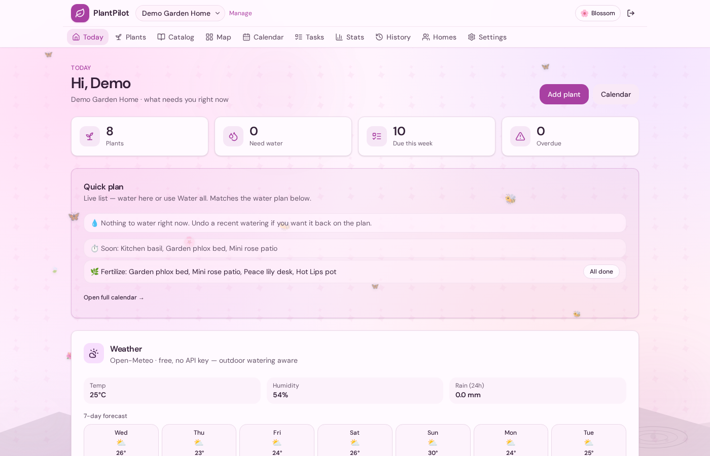
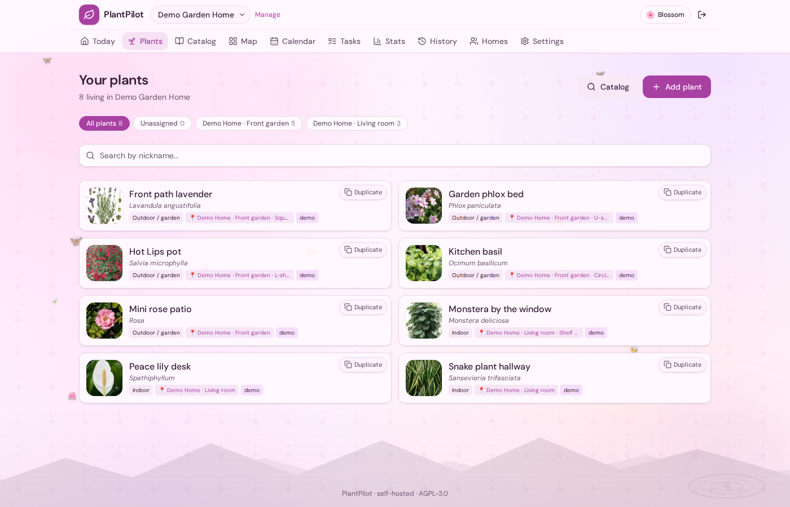
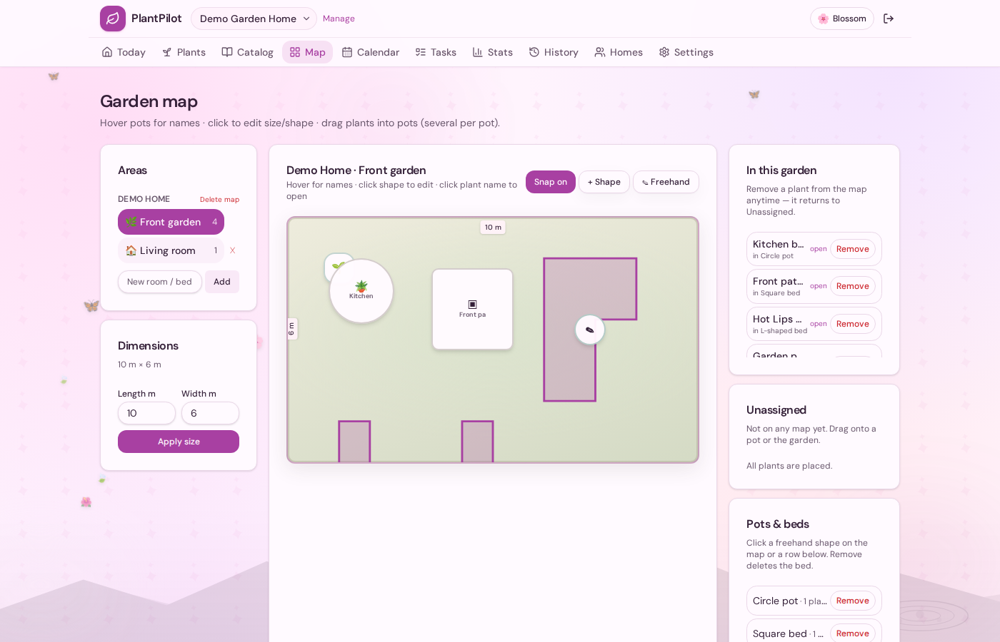
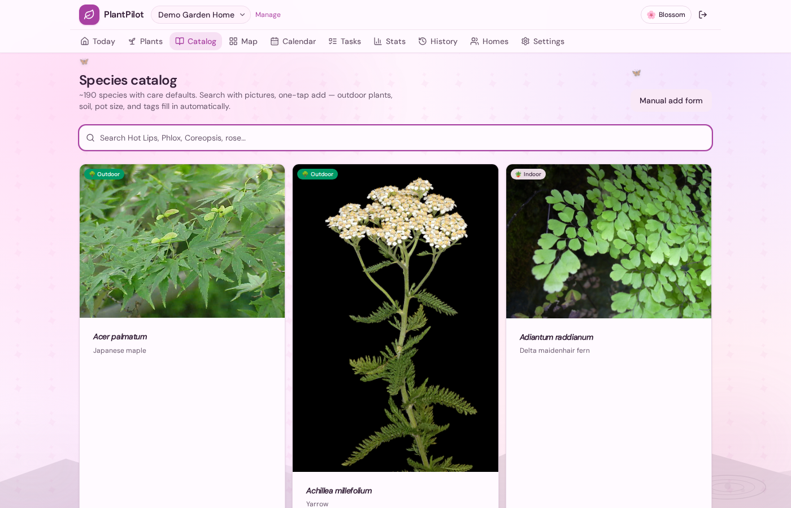
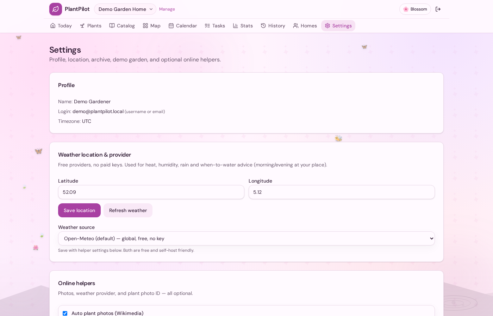
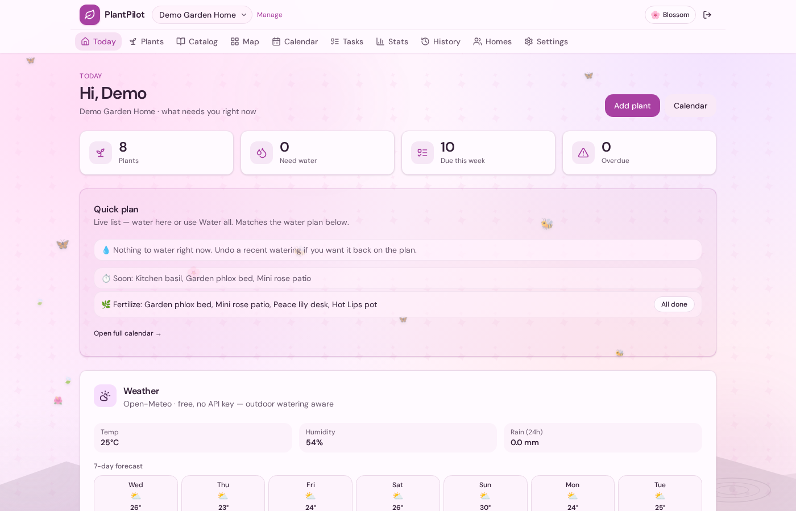
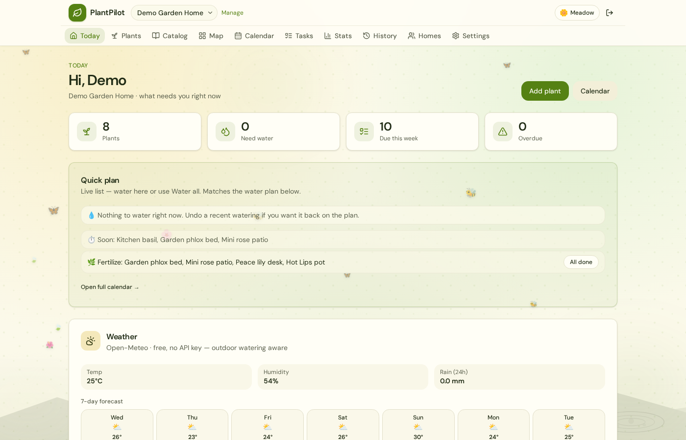
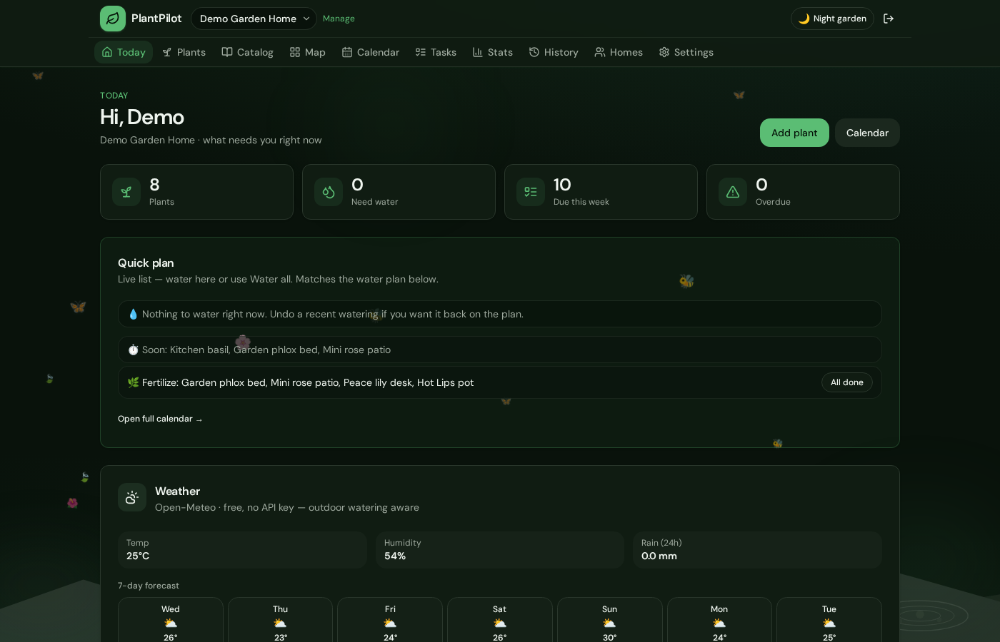
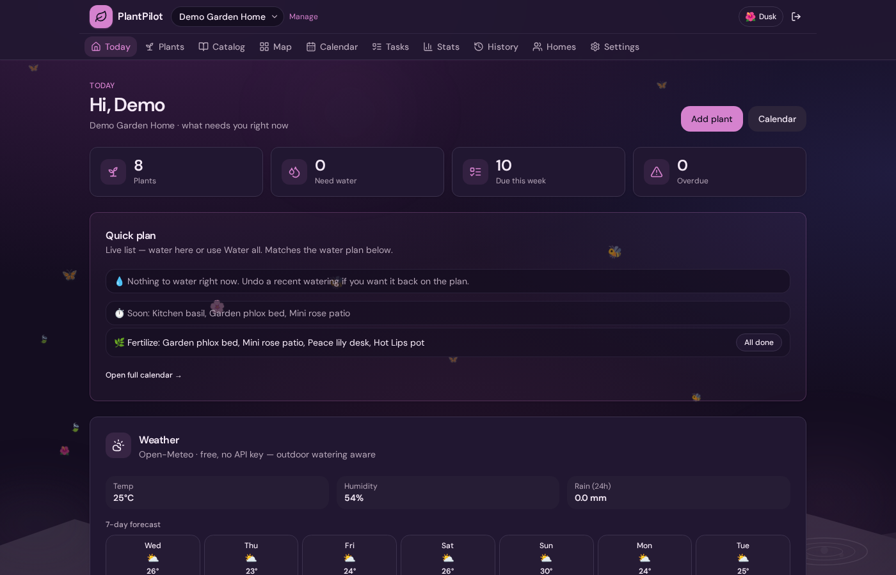

# RootCore

**Self-hosted plant care from the roots up** — watering intelligence, garden maps, shared homes, and a calm UI. Your data stays on **your** machine.

> the product is **RootCore**.


<p align="center">
  
</p>

<p align="center"><em>Today: clear water plan (how much · when), weather, tips, and seasonal ideas</em></p>

---

## Why RootCore?

Most plant apps are cloud-only inventory. RootCore is built for **self-hosting**:

| You get | Details |
|--------|---------|
| **Clear watering** | How much (~ml), when (morning/evening in your timezone), heat & humidity aware |
| **Garden map** | Rooms, pots, freehand L/U beds, drag plants, custom emojis |
| **Multi-home** | Balcony, allotment, parents’ house — separate collections |
| **Photos** | Upload yours or **search free Wikimedia** and pick a cover |
| **Demo garden** | One click sample plants + map |
| **Themes** | Blossom, meadow, night garden, dusk — ambient bees optional |

---

## Screenshots

| Today | Plants | Map |
|:---:|:---:|:---:|
|  |  |  |

| Catalog | Settings (APIs) |
|:---:|:---:|
|  |  |

---

## Themes

Switch anytime in **Settings → Appearance** (saved in the browser). Ambient butterflies/bees have an on/off switch and a **0–100 intensity** slider.

| Blossom | Meadow | Night | Dusk |
|:---:|:---:|:---:|:---:|
|  |  |  |  |

Also: **Light garden** and **System** (follow device).

---

## Online services & APIs (all optional)

RootCore works **offline-first** for your plants, tasks, and maps. Network helpers are opt-in in **Settings**.

| Service | What it does | API key? | Cost | Where configured |
|--------|----------------|----------|------|------------------|
| **[Open-Meteo](https://open-meteo.com/)** | Weather (temp, humidity, rain) for outdoor watering & “when to water” | **No** | Free | Settings → location + weather source |
| **[MET Norway](https://api.met.no/)** (yr.no) | Alternative weather provider | **No** (User-Agent only) | Free | Settings → Weather source |
| **[Wikimedia Commons](https://commons.wikimedia.org/) / Wikipedia** | Free plant photos (auto cover + **search & pick**) | **No** | Free | Auto photos on/off; plant page → Find photo |
| **[PlantNet](https://my.plantnet.org/)** | Identify species from a photo | **Yes** (free personal key) | Free tier | Settings → Plant photo ID + API key |

### What never leaves your server by default

- Your plant list, care history, photos you upload, households, passwords  
- Coordinates are sent **only** to the weather provider you choose when weather is fetched  
- PlantNet is used **only** if you add a key and use photo ID  
- Wikimedia is used **only** for auto-cover / photo search  

### Why not Google / paid plant apps?

Self-hosters usually want free, documented APIs without accounts for every feature. Open-Meteo and MET Norway need no keys. PlantNet is the best open photo-ID option; commercial apps (PictureThis, Plant.id) need paid commercial licenses.

---

## Quick start

### One command (dev)

```bash
git clone https://github.com/Username-010/rootcore.git
cd rootcore
chmod +x scripts/rootcore
./scripts/rootcore start
```

Open **http://localhost:5173** → create username/password (email optional) → set location → **Settings → Load demo garden**.

```bash
./scripts/rootcore stop        # API + web
./scripts/rootcore stop --all  # + Postgres
```

### Docker (single port, production-style)

```bash
cp .env.example .env
# openssl rand -hex 32  → set SECRET_KEY=
docker compose up -d --build
# App: http://localhost:8000
```

Podman:

```bash
export DOCKER_HOST=unix://$XDG_RUNTIME_DIR/podman/podman.sock
docker-compose up -d --build
```

Data volumes: `rootcore_pgdata` (database), `rootcore_media` (photos).

More: [EXPORT.md](./EXPORT.md) · [GITHUB.md](./GITHUB.md)

---

## Features (current)

- **Auth** — username *or* email, JWT, multi-household RBAC, invites  
- **Watering engine** — pot, soil, season, heat, humidity, rain → plain-language care card  
- **Today** — water plan, quick plan (clickable), bulk water/done, undo restores plan  
- **Map** — freehand beds, drag pots/plants, pot & plant emojis  
- **Catalog** — species with photos; archive restore/delete  
- **Tips** — tip of the day, plant of the day, seasonal recommendations  
- **Themes + ambient** — blossom / meadow / night / dusk + animation slider  

---

## Requirements

| Dev | Production |
|-----|------------|
| Python 3.12+, Node 20+, Docker/Podman | Docker Compose only |

---

## Repository layout

```
rootcore/
├── backend/           # FastAPI · SQLAlchemy · Alembic · watering engine
├── frontend/          # React · Vite · Tailwind
├── docs/screenshots/  # README images
├── deploy/            # Dockerfiles, Caddy example
├── docker-compose.yml
└── scripts/rootcore # one-command start/stop
```

Design notes (optional reading): [PROJECT_PLAN.md](./PROJECT_PLAN.md) · [SPEC.md](./SPEC.md) · [API.md](./API.md)

---

## License

[GNU Affero General Public License v3.0](./LICENSE) — free to self-host and share; network services based on this code must provide source to users.
